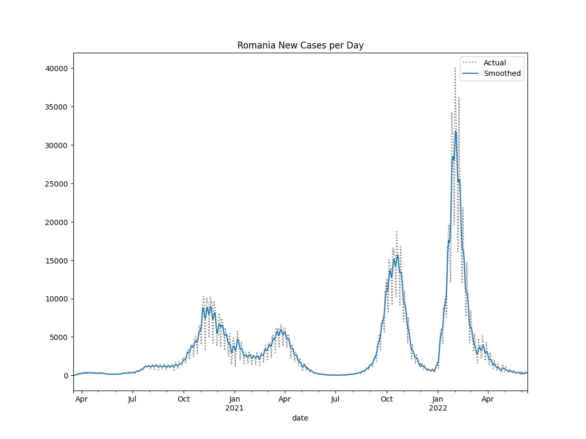
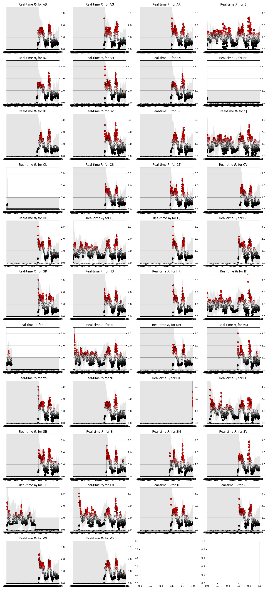
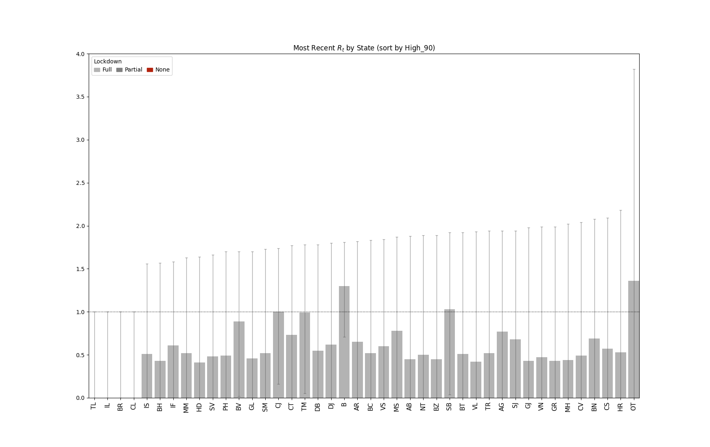
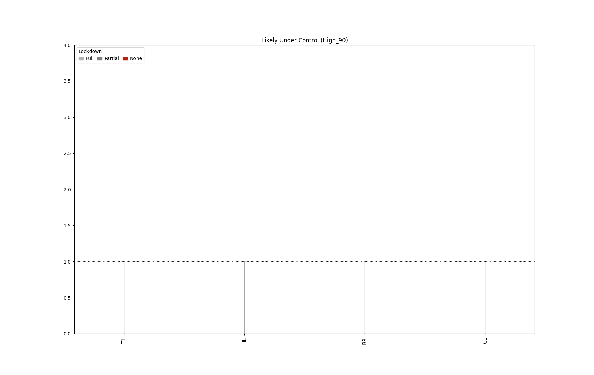
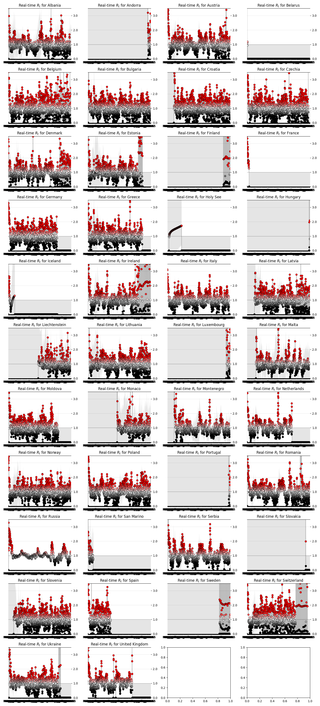
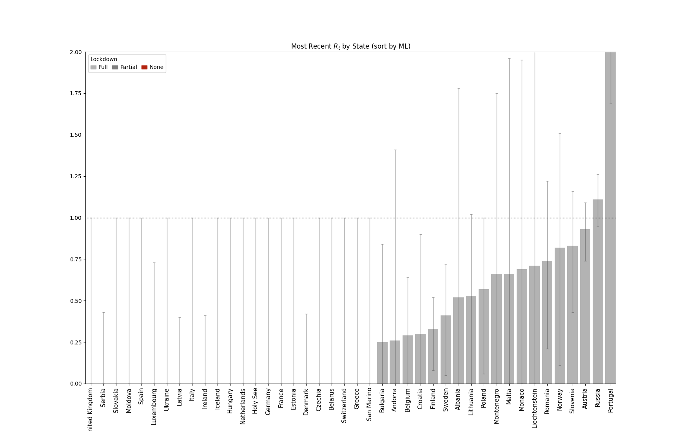
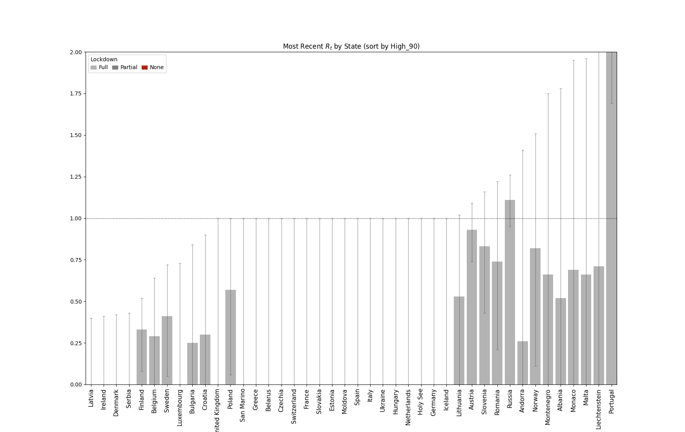
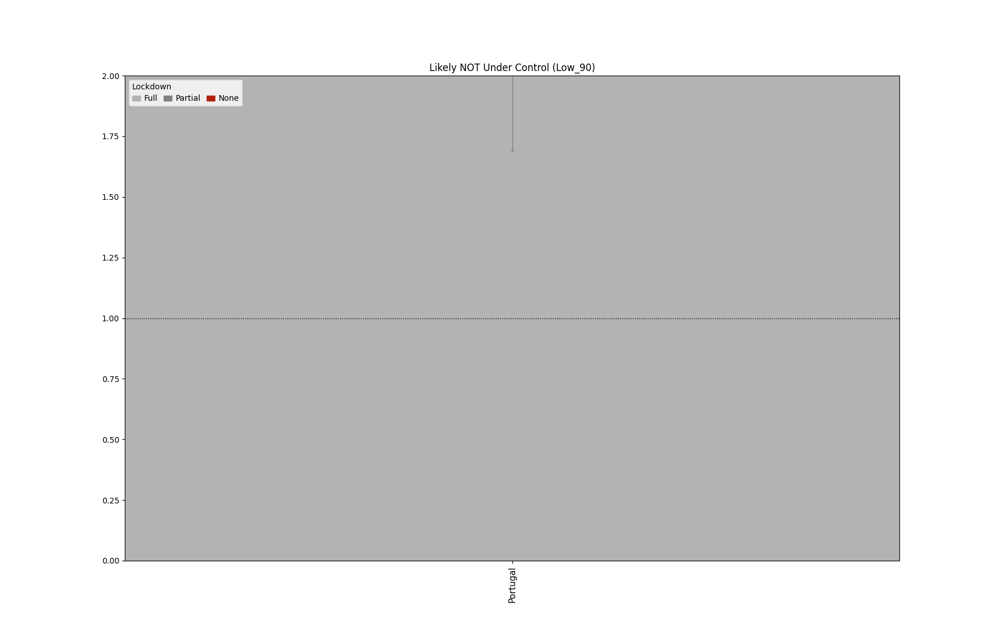
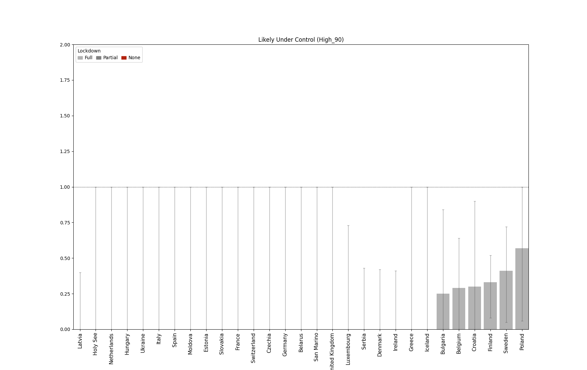

# COVID-19 Projects 
A collection of work related to COVID-19

## R0 in Realtime (EUROPE & ROMANIA)
**A mimetic implementation after:** [Realtime-R0](https://github.com/k-sys/covid-19/blob/master/Realtime%20R0.ipynb)

> Extending my thanks to [@k-sys](https://github.com/k-sys/) for the proposal.

### Explanations

**Definition**

The basic reproduction number (R0), also called the basic reproduction ratio or rate or the basic 
reproductive rate, is an epidemiologic metric used to describe the contagiousness or transmissibility
of infectious agents. R0 is affected by numerous biological, sociobehavioral, and environmental 
factors that govern pathogen transmission and, therefore, is usually estimated with various types 
of complex mathematical models, which make R0 easily misrepresented, misinterpreted, and misapplied. 
R0 is not a biological constant for a pathogen, a rate over time, or a measure of disease severity, 
and R0 cannot be modified through vaccination campaigns. R0 is rarely measured directly, and modeled 
R0 values are dependent on model structures and assumptions. Some R0 values reported in the scientific 
literature are likely obsolete. R0 must be estimated, reported, and applied with great caution because 
this basic metric is far from simple.
> (source): [Complexity of the Basic Reproduction Number (R0)](https://wwwnc.cdc.gov/eid/article/25/1/17-1901_article)

**The Basic Gist**

#### Romania

:heavy_exclamation_mark: Data for some counties is inconclusive & incoherent. This is due to the fact that the 
government decided not to publish official information for daily cases per county. 
There were only national reports in that time.

:heavy_exclamation_mark: Due to inconsistent data some county charts can be misleading or dead wrong.
Hopefully these will be remedied once official data starts coming in.    

###### Rt For Romania

###### Rt For Every County

#### Europe
###### Rt for every country

### How does it work

- The algorithm needs daily data for individual elements (states or counties) so the program 
will execute each day at noon `(12:00 PM GMT+2)`
- Data will be gathered from the specified sources
- Plots + output data will be generated
- After all is done, the program will auto-commit the new data to the repo
- Last step will update this page! 

### Sources
- World Data: [https://corona.lmao.ninja/v2/historical](https://corona.lmao.ninja/v2/historical)
- Romania:  [DateLaZi](https://api1.datelazi.ro/api/v2/data)

> :question: I'm still trying to find reliable sources for data. [Code4Romania](https://github.com/code4romania)
> does a great job to centralize all the information from reliable sources. World data and good APIs 
> for COVID-19 data seem hard to find. 