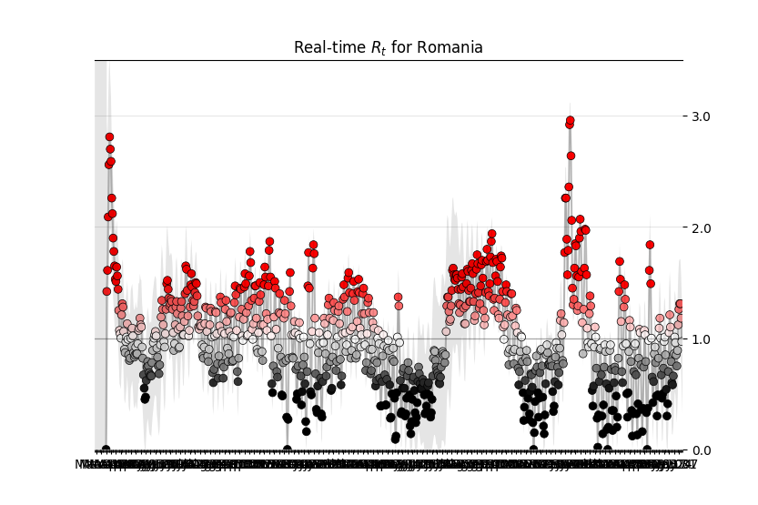
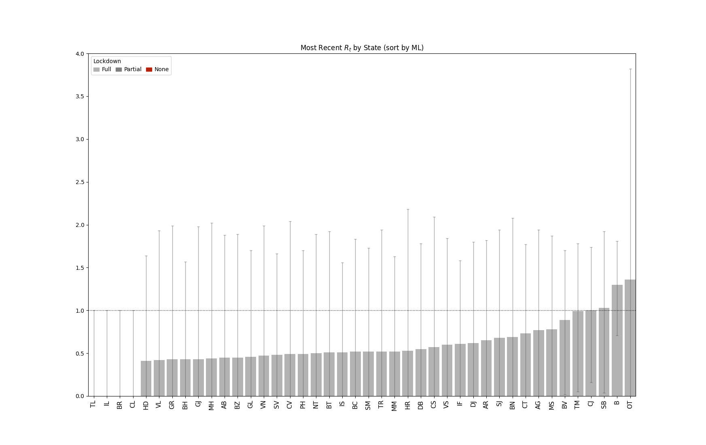
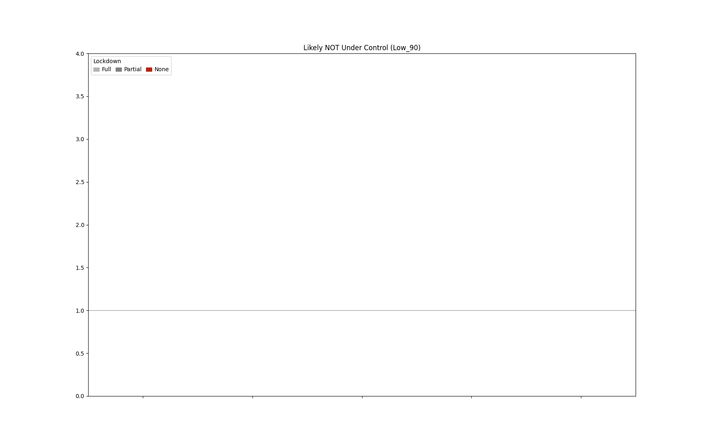

# COVID-19 Projects 
A collection of work related to COVID-19

## R0 in Realtime
**A mimetic implementation after:** [Realtime-R0](https://github.com/k-sys/covid-19/blob/master/Realtime%20R0.ipynb)

**Extending my thanks to [@k-sys](https://github.com/k-sys/) for the proposal.**

:globe_with_meridians: **This project is dedicated to Romania & Europe**

:warning: Data will be updated daily!

- [COVID-19 Projects](#covid-19-projects)
  * [R0 in Realtime](#r0-in-realtime)
    + [Explanations](#explanations)
      - [Definition](#definition)
      - [Comparative R0](#comparative-r0)
      - [The Basic Gist](#the-basic-gist)
    + [Romania](#romania)
      - [Rt For Romania](#rt-for-romania)
      - [Rt For Every County](#rt-for-every-county)
    + [Europe](#europe)
      - [Rt For Every State](#rt-for-every-state)
    + [How Does It Work](#how-does-it-work)
    + [Sources](#sources)

### Explanations

#### Definition
> (source): [Complexity of the Basic Reproduction Number (R0)](https://wwwnc.cdc.gov/eid/article/25/1/17-1901_article)

”The basic reproduction number (R0), also called the basic reproduction ratio or rate or the basic 
reproductive rate, is an epidemiologic metric used to describe the contagiousness or transmissibility
of infectious agents. R0 is affected by numerous biological, sociobehavioral, and environmental 
factors that govern pathogen transmission and, therefore, is usually estimated with various types 
of complex mathematical models, which make R0 easily misrepresented, misinterpreted, and misapplied. 
R0 is not a biological constant for a pathogen, a rate over time, or a measure of disease severity, 
and R0 cannot be modified through vaccination campaigns. R0 is rarely measured directly, and modeled 
R0 values are dependent on model structures and assumptions. Some R0 values reported in the scientific 
literature are likely obsolete. R0 must be estimated, reported, and applied with great caution because 
this basic metric is far from simple.”

>RO:
„Numărul standard de reproducere (R0), numit și rația standard de reproducere sau rata sau rata standard de
reproducere, e un indice epidemiologic folosit pentru a descrie contagiozitatea și transmisibilitatea 
agenților de infecție. R0 este afectat de numeroși factori biologici, socio-comportamentali și ai mediului 
înconjurător ce guvernează transmisia patogenului și care este estimat cu diverse tipuri de modele matematice
ce pot face din R0 să fie reprezentat, interpretat și aplicat greșit. R0 nu e o constantă biologică pentru un 
patogen, o rată în timp, sau un indice al severității bolii, și R0 nu poate fi modificat prin campanii de vaccinare.
R0 este rareori măsurat direct, și valorile R0 modelate sunt dependente de structurele modelelor și ipoteze. 
Unele valori R0 raportate în literatura de specialitate sunt probabil învechite. R0 trebuie estimat, raportat, 
și aplicat cu multă atenție fiindcă metrica aceasta e departe de a fi simplă.”  

#### Comparative R0
> (source): [Comparative RO](https://www.businessinsider.com/coronavirus-contagious-r-naught-average-patient-spread-2020-3)

- `R0` for measles: `3.7 < R0 < 203`
- `R0` for influenza: `= 1.3`

>RO:
>- R0 pentru pojar: 3.7 < R0 < 203
>- R0 pentru gripă (influenza): = 1.3

#### The Basic Gist

- As a pandemic evolves, increasing restrictions (or potential releasing of restrictions) changes `Rt`. 
- **Knowing the current `Rt` is essential**. 
- When `Rt >> 1` the pandemic will spread through a large part of the population. 
- If `Rt < 1`, the pandemic will slow quickly before it has a chance to infect many people. 
- The lower the `Rt` the more manageable the situation. In general, any `Rt < 1` means things are under control.
- [Well-respected epidemiologists](https://www.nytimes.com/2020/04/06/opinion/coronavirus-end-social-distancing.html) argue that tracking `Rt` is the only way to manage through this crisis.

- `Likely NOT Under Control` means:
    * `Rt > 1`
    * `Maximum possible (High) Rt > 1`
    * `Minimum possible (Low) Rt > 1`
- `Likely Under Control` means:
    * `Rt < 1`
    * `Maximum possible (High) Rt < 1`
    * `Minimum possible (Low) Rt < 1`

> RO:
> - În timp ce pandemia evoluează, relaxarea sau impunerea restricțiilor modifică Rt.
> - A ști valoarea curentă a lui `Rt` este esențial.
> - Dacă `Rt >> 1`, pandemia (boala) se va răspândi la o bună parte din populație.
> - Dacă `Rt < 1`, pandemia (boala) va înceti rapid înainte să infecteze mulți oameni.
> - Cu cât valoarea lui Rt e mai mică cu atât situația devine mai controlabilă. 
> - În general, orice valoare `Rt < 1` înseamnă că lucrurile sunt sub control.
> - Epidemiologi respectați susțin ideea că utilizarea valorii Rt e singura modalitate de a gestiona criza.  
> - `Likely NOT Under Control` (Cel mai probabil a nu fi sub control) înseamnă:
>    * `Rt > 1`
>    * `Valoarea maximă posibilă (High) Rt > 1`
>    * `Valoarea minimă posibilă (Low) Rt > 1`
>- `Likely Under Control`(Cel mai probabil sub control) înseamnă:
>    * `Rt < 1`
>    * `Valoarea maximă posibilă (High) Rt < 1`
>    * `Valoarea minimă posibilă (Low) Rt < 1`

### Romania

:heavy_exclamation_mark: Data for some counties is inconclusive & incoherent. This is due to the fact that the 
government decided not to publish official information for daily cases per county. 
There were only national reports in that time.

> RO:
! Datele unor județe NU sunt concludente și nici coerente. Asta e din cauza faptului că guvernul a decis să nu 
publice zilnic informații oficiale per județ. Doar informațiile de nivel național au fost transmise.    

:heavy_exclamation_mark: Due to inconsistent data some county charts are missing.
Hopefully these will be remedied once official data starts coming in or when the algorithm will include such data.  

> RO:
! Din pricina inconsistenței datelor o parte din grafice pot lipsi. Să sperăm că problemele
vor fi remediate odată ce date oficiale vor fi furnizate sau când algoritmul va include și astfel de date.

:heavy_exclamation_mark: I am still looking for consistent data & trying out different changes in the algorithm
to see if parameter changes will impact the processing of data.

> RO:
! Încă sunt în căutare de date consistente și încerc diferite modificări în algoritm pentru a vedea dacă 
modificările de parametrii influențează procesarea de date.  

:warning: The sudden fall to `0 value` could mean 2 things: `1. There is no new case in that area`
or `2. There are no new cases reported`. **This will affect the `Likely Under Control` plot - The 0 values 
should not be taken into consideration at this point in time.**  

> RO:
! Tangenta bruscă către 0 a valorilor poate însemna 2 lucruri: 1. Nu a fost raportat niciun nou caz în zona 
respectivă, 2. Nu există informații noi desspre numărul de cazuri. 
> **Acest lucru va afecta graficul `Likely Under Control (Cel mai probabil sub control)` - valorile de 0 NU
ar trebui să fie luate în considerare în acest moment.** 

#### Rt For Romania

#### Rt For Every County

### Europe
#### Rt For Every State

### How Does It Work

- The algorithm needs daily data for individual elements (states or counties) so the program 
will execute each day at noon
- Data will be gathered from the specified sources
- Plots + output data will be generated
- After all is done, the program will auto-commit the new data to the repo
- Last step will update this page! 

> RO:
> - Algoritmul are nevoie de date pentru elemente individuale (state sau provincii/județe/zone) astfel 
programul va fi executat în fiecare zi la amiază.
> - Datele vor fi colectate de la sursele menționate.
> - Graficile și datele procesate vor fi generate.
> - După ce totul se va termina cu succes, programul va înscrie datele în repository.
> - De asemenea pagina aceasta va fi adusă la zi. 

### Sources
- World Data: [https://corona.lmao.ninja/v2/historical](https://corona.lmao.ninja/v2/historical)
- World Data: [CSSEGISandData COVID-19](https://github.com/CSSEGISandData/COVID-19/raw/master/csse_covid_19_data/csse_covid_19_time_series/time_series_covid19_confirmed_global.csv)
- Romania:  [DateLaZi](https://api1.datelazi.ro/api/v2/data)
- Romania:  [https://covid19.geo-spatial.org](https://covid19.geo-spatial.org/api/dashboard/getDailyCasesa)

> :question: I'm still trying to find reliable sources for data. [Code4Romania](https://github.com/code4romania)
> does a great job to centralize all the information from reliable sources. World data and good APIs 
> for COVID-19 data seem hard to find. 
